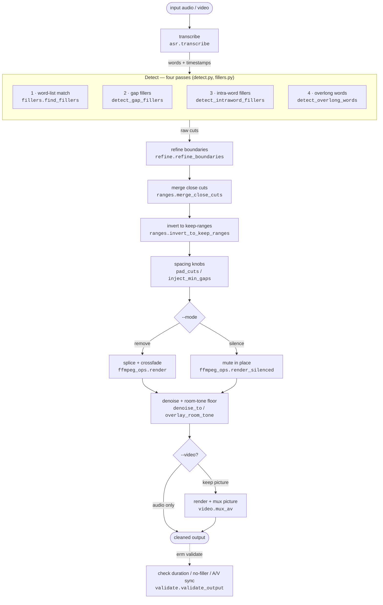
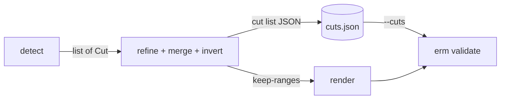

# Architecture overview

This is the map of how `erm` is put together — start here, then follow the links
into each stage's design doc for the detail. For the vocabulary and the
cross-cutting signal-processing ideas referenced throughout, see
[Concepts & glossary](concepts.md).

At the highest level, `erm` does four things, all on your machine:

1. **Transcribe** the audio to word-level timestamps (`faster-whisper`).
2. **Detect** filler regions — four passes that each produce candidate *cuts*.
3. **Refine** those cuts into clean, click-free splice points and combine them.
4. **Render** the result with ffmpeg — splicing (`remove`) or muting
   (`silence`), under a uniform room-tone floor — then optionally mux video and
   **validate** the output.

## The pipeline

The detectors only ever **propose** cuts; everything after refinement is about
turning that cut list into clean audio. The cut list is the unit of state that
flows from detection all the way through to validation (see
[where state lives](#where-state-lives)).

## Module map

| Module | Responsibility | Deep dive |
| --- | --- | --- |
| `asr.py` | Whisper front end: verbatim prompt, word timestamps, CUDA→CPU fallback | [Transcription](transcription.md) |
| `fillers.py` | Default filler set, normalization, elongation matching | [Detection](detection.md) |
| `detect.py` | The three audio-domain detection passes (gap, intra-word, overlong) | [Detection](detection.md) |
| `envelope.py` | The shared frame-based RMS energy envelope | [Concepts](concepts.md#rms-energy-envelope) |
| `acoustic.py` | Sustained-vowel / pitch confirmation that guards the aggressive passes | [Detection](detection.md#pitch-confirmation-acousticpyis_sustained_vowel) |
| `refine.py` | Energy-minimum + zero-crossing boundary refinement | [Render pipeline](render-pipeline.md) |
| `ranges.py` | Cut merging, keep-range inversion, padding, min-gap injection | [Render pipeline](render-pipeline.md) |
| `ffmpeg_ops.py` | Splice/mute render, crossfade scaling, denoise, room-tone overlay | [Render pipeline](render-pipeline.md) · [Denoise & room tone](denoise-and-room-tone.md) |
| `video.py` | CFR render, frame-snapped fades, A/V mux and conform | [Video render & A/V sync](video-render.md) |
| `validate.py` | Post-hoc invariants: duration math, no-filler-survives, A/V sync | [Render pipeline](render-pipeline.md) |
| `models.py` | The `Cut` / `Word` data models | [Concepts](concepts.md#data-models-the-cut-list) |
| `cli.py` | Argument parsing and orchestration of the above | [CLI reference](cli-reference.md) |

## Where state lives

`erm` keeps no database and no hidden state — the **cut list** is the spine. It
is born in detection (one `Cut` per filler region), reshaped by refinement and
the range operations, written to disk as JSON (`--json`, or auto-named beside
the output), and read back by `erm validate` to check the render against the
source.

The on-disk shape of that cut list (its fields and their meanings) is documented
in [Concepts → the cut list](concepts.md#data-models-the-cut-list).

## The five stage docs

Each covers one slice of the flow above in depth:

- **[Detection](detection.md)** — the four passes, the shared RMS-envelope
  substrate, and the sustained-vowel pitch confirmation.
- **[Render pipeline](render-pipeline.md)** — refinement, close-cut merging,
  crossfade scaling, `remove` vs `silence`, and the spacing knobs.
- **[Video render & A/V sync](video-render.md)** — the `--video` path: sync by
  construction (CFR + frame-snapped shared fades), the tail conform, codecs.
- **[Denoise & room tone](denoise-and-room-tone.md)** — the denoise routings and
  the room-tone overlay that gives the output a single uniform noise floor.
- **[Transcription](transcription.md)** — the verbatim prompt that makes filler
  detection possible, and the device fallback.
