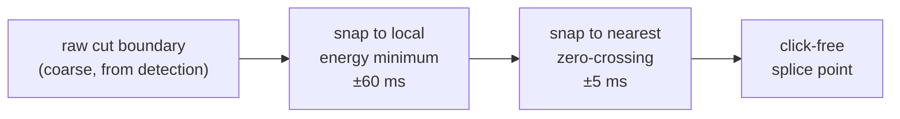
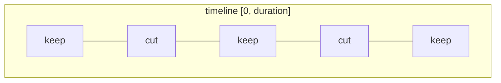

# Concepts & glossary

The [stage docs](architecture.md#the-five-stage-docs) each explain one part of
the pipeline in depth. This page collects the vocabulary and the cross-cutting
signal-processing ideas they all lean on, so the terms are defined in one place.

If you haven't yet, skim the [architecture overview](architecture.md) first —
it's the map this page annotates.

## Glossary

Disfluency
:   An interruption in the flow of speech — fillers, false starts, repetitions.
    `erm` targets the filler subset.

Filler
:   A meaningless sound that pads speech while the speaker thinks: *um*, *uh*,
    *er*, *erm*, *ah*, *hmm*, *mhm*, *mm*, *uh-huh*. The default set lives in
    `fillers.DEFAULT_FILLERS`; tune it with `--fillers` / `--add-fillers` /
    `--remove-fillers`.

Elongation
:   A stretched filler — *ummmm*, *uhhhhh*. Matched by a regex over each stem
    rather than an enumerated list, so any length matches (`fillers.py`).

Cut
:   A single region to be removed or muted: `(start, end, word)` — the `Cut`
    model. Detection produces cuts; everything downstream reshapes them.

Splice
:   The join created when a cut is removed and the surviving audio on either
    side is rejoined. A splice is where clicks and abrupt transitions can appear
    — hence boundary refinement and crossfades.

Keep-range
:   The complement of the cuts — the spans of audio that *survive*. Cuts and
    keep-ranges together partition the whole timeline
    (see [cut and keep-range inversion](#cut-and-keep-range-inversion)).

Room tone
:   The recording's own background noise with no speech — HVAC hum, mic hiss.
    `erm` samples a quiet stretch and loops it under the output so silence never
    sounds like a digital dropout. → [Denoise & room tone](denoise-and-room-tone.md)

Noise floor
:   The steady low-level background energy of a recording. Room tone *is* the
    noise floor, captured and reused; keeping it uniform across edits is the
    point of the overlay.

RMS envelope
:   A coarse, frame-by-frame loudness contour of the signal — the shared
    substrate for silence detection and boundary snapping.
    → [below](#rms-energy-envelope)

Zero-crossing
:   A sample where the waveform crosses zero amplitude. Splicing at a
    zero-crossing avoids clicks. → [below](#zero-crossing-splicing)

Voiced run
:   A contiguous stretch of above-threshold energy in the envelope — a candidate
    chunk of sound. The audio detectors work by finding voiced runs in silences
    and inside overlong words (`detect._voiced_runs_in_region`).

Dip bridging
:   Treating a brief sub-threshold dip *inside* a voiced run as part of the run,
    so a flickering "ummmm" stays one run instead of fragmenting.
    → [Detection](detection.md#the-shared-acoustic-substrate)

Silence floor
:   The energy threshold, **relative to the file's own peak**, below which a
    frame counts as silence. → [below](#db-relative-silence-floor)

Equal-power crossfade
:   A crossfade whose two ramps keep total power roughly constant, avoiding the
    loudness dip a naïve linear fade produces. → [below](#equal-power-crossfade)

Expected word duration
:   A length budget for a word from its text: `0.18 + 0.12 × len(text)` seconds
    (`detect.expected_max_word_duration`). A word much longer than its budget is
    a clue that a filler is hiding inside it (passes 3 and 4).

CFR / VFR
:   Constant vs variable frame rate. `erm` forces CFR on video so the
    audio/video duration math is exact. → [Video render & A/V sync](video-render.md)

A/V sync
:   Audio and picture staying aligned. With `--video`, both streams render from
    the same edit timeline with the same frame-snapped fades, so they're in sync
    by construction (within ~1 frame).

## Cross-cutting theory

### RMS energy envelope

Every audio-domain detector and the boundary refiner work off the same
primitive: a frame-based **RMS energy envelope** (`envelope._rms_envelope`).
The signal is chopped into non-overlapping 10 ms windows and each window is
reduced to one number — the root-mean-square of its samples:

```
E[n] = sqrt( mean( x[i]² ) )   over the samples in frame n
```

RMS (rather than peak) is used because it tracks *perceived loudness* and is
robust to single-sample spikes. 10 ms is fine enough to locate word boundaries
yet coarse enough to smooth over waveform wiggle, and computing it once per pass
keeps detection cheap. The envelope returns `(values, hop_samples)` so callers
can convert frame indices back to sample positions.

→ deep dive: [Detection — the shared acoustic substrate](detection.md#the-shared-acoustic-substrate)

### dB-relative silence floor

"Silence" isn't an absolute level — a whisper and a shout have different floors.
`erm` defines the threshold *relative to each file's own loudest frame*:

```
threshold = peak * 10 ** (silence_floor_db / 20)   # silence_floor_db = -40 dB
```

A frame is "voiced" if it's within 40 dB of the peak. Because the reference is
the file's own peak, the same setting works on a quiet lavalier recording and a
hot studio mic with no per-file tuning. The `/ 20` is the amplitude (not power)
dB convention, since the envelope is an amplitude quantity.

### Zero-crossing splicing

When two fragments are joined at a splice, any amplitude *step* between them is a
click. `erm` refines every cut boundary in two stages (`refine.refine_boundaries`):

1. **Snap to a local energy minimum** within ±`--search-ms` (60 ms) — move the
   boundary to the quietest nearby point, so the splice lands in silence.
2. **Snap to the nearest zero-crossing** within ±`--zc-search-ms` (5 ms) — so
   both sides of the join sit at amplitude ≈ 0 and there's no step.

The search is clamped so a boundary never crosses into a neighboring word.



→ deep dive: [Render pipeline — refinement](render-pipeline.md)

### Equal-power crossfade

Even after snapping, a hard splice between two different ambiences can be
audible. `erm` blends across the join with a crossfade whose length **scales
with the cut**:

```
fade_ms = clamp(cut_ms × crossfade_factor, min_crossfade_ms, max_crossfade_ms)
```

with `crossfade_factor = 0.15`, `min = 50 ms`, `max = 120 ms`
(`ffmpeg_ops._splice_crossfade_s`). The fade is then capped so it can't reach
more than partway into the words on either side — a long fade must never
swallow real speech. A naïve *linear* crossfade sums two ramps that dip in total
power at the midpoint; an **equal-power** fade shapes the ramps so the combined
power stays roughly flat, which is why the join doesn't "duck".

→ deep dive: [Render pipeline — crossfade scaling](render-pipeline.md)

### Cut and keep-range inversion

Detection thinks in **cuts** (what to drop); the renderer needs **keep-ranges**
(what to play). `ranges.invert_to_keep_ranges` computes the complement over
`[0, duration]`, after `merge_close_cuts` has folded together cuts whose
surviving fragment would be too short to keep. The invariant: cuts and
keep-ranges are a partition of the timeline — every instant is in exactly one.



→ deep dive: [Render pipeline](render-pipeline.md)

## Data models: the cut list

Two small dataclasses (`models.py`) carry everything:

`Word(text, start, end)`
:   One ASR token with its word-level timestamps — the input to detection.

`Cut(start, end, word)`
:   One filler region. `word` is its label (the matched filler, or `<gap>` for a
    detector-found region). `Cut.as_dict()` serializes it for the cut list.

When you pass `--json` (or let `erm` auto-name it), the **cut list** is written
as JSON:

```json
{
  "input": "talk.wav",
  "duration_s": 123.45,
  "mode": "remove",
  "cuts": [
    { "start": 12.34, "end": 12.56, "word": "um" },
    { "start": 34.10, "end": 34.82, "word": "<gap>" }
  ],
  "keep_ranges": [
    { "start": 0.0, "end": 12.34 },
    { "start": 12.56, "end": 34.10 }
  ],
  "injected_gap_s": 0.0,
  "time_saved_s": 0.94
}
```

| Field | Meaning |
| --- | --- |
| `input` | Source path. |
| `duration_s` | Source duration in seconds. |
| `mode` | `remove` (excise + splice) or `silence` (mute in place). |
| `cuts` | The filler regions — each a `Cut` (`start`, `end`, `word`). |
| `keep_ranges` | The surviving spans — the [inversion](#cut-and-keep-range-inversion) of the cuts. |
| `injected_gap_s` | Total silence added by `--min-gap-ms` (remove mode; `0.0` otherwise). |
| `time_saved_s` | Net reduction = removed − injected (always `0.0` in silence mode). |
| `muted_s` | *Silence mode only* — total audio muted in place. |

`erm validate` reads this file back and checks the render against it — the
duration math per mode, the no-filler-survives invariant, and (for video) the
A/V-sync bound. → [Render pipeline — cut-list JSON & validation](render-pipeline.md)
